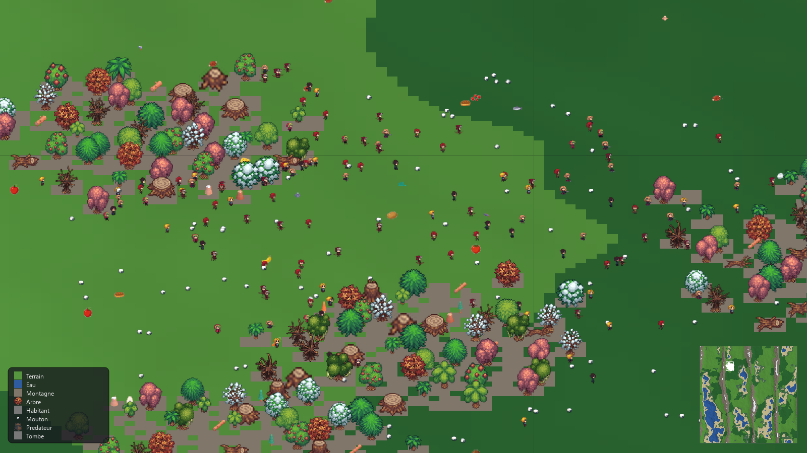
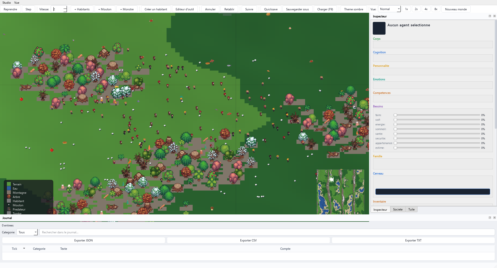

# 🧠🌍 Neural World Simulation

### An open-ended neural society: hundreds of learning agents that live, learn, build villages and write their own history — emergent behavior, zero scripted quests.

[](https://www.python.org/)
[](https://www.riverbankcomputing.com/software/pyqt/)
[](https://numpy.org/)
[](#-the-brain-each-agent-learns-for-real)
[](LICENSE)
[](#-contributing--contribuer)



> **No missions. No scripts. No game over.**
> Every inhabitant perceives a limited, local world (day/night, attention, memory — never omniscience), **decides with its own neural network**, acts through 15 composable primitive actions, and **learns from the consequences via REINFORCE** — for its whole life, from childhood to old age. Villages, farms, territories, families, cultures and reputations **emerge**. You just watch. Or intervene. 🔬

*🇫🇷 Une société neurale open-ended : des centaines d'agents qui apprennent, vivent, construisent des villages et écrivent leur histoire — aucun script, aucune quête imposée. Voir [le résumé français](#-en-français) plus bas.*

---

## ✨ Why this project stands out

| | |
|---|---|
| 🧠 **Real on-device learning** | Each agent runs an **Elman recurrent network** (132 sensory inputs → 15 actions + 6 strategies + 8 targets) trained **live with REINFORCE**, eligibility traces, age-modulated plasticity (children learn 2× faster) and personality-driven exploration. |
| 🌾 **A full artificial life loop** | Hunger, thirst, sleep, energy, shelter, family, esteem — agents farm, harvest, craft tools, build (chest, barn, workshop, well…), trade, talk, mourn their dead and pass on culture. |
| 🗺️ **A vast procedural world** | **1000 × 1000 tiles**, OpenSimplex biomes, mountains, lakes, slope-aware forests, seasons, day/night cycle, fire propagation, pheromone territories. Up to **800 inhabitants · 300 sheep · 20 predators**. |
| 🔬 **A laboratory, not just a game** | Event recorder, **A/B experiment runner**, world-history timeline, scenario studio, JSON/CSV/TXT export — built for **ML researchers and simulation nerds**. |
| 🖥️ **PyQt6 Studio UI** | Live map (zoom/tilt, minimap, effects layer), agent inspector (body · cognition · personality · emotions · skills · needs · family · **brain** · inventory), population charts, journal, tile editor, tool editor, quicksave (F9), 1×–8× speed, dark theme. |
| 🧪 **Tested** | 12+ pytest suites: behavior chains, save round-trips, terrain chunks, overlays, headless runs. Pure **NumPy + PIL** engine — no Pygame, headless-friendly. |



---

## 🚀 Quickstart

```bash
git clone https://github.com/saladinlorenz/Neural-World-Simulation.git
cd Neural-World-Simulation
pip install -r requirements.txt   # numpy, Pillow, PyQt6, opensimplex

# Launch a living world: 60 inhabitants, 40 sheep, seed 7
python main_qt.py --agents 60 --sheep 40 --seed 7

# Empty world to colonize yourself (spawn agents from the toolbar)
python main_qt.py --blank 1

# Faster / slower observation
python main_qt.py --speed 4
```

**Headless capture** (renders screenshots without opening a window — great for papers & thumbnails):

```bash
python tools/screenshot.py --out docs/img/hero.png --ticks 350 --agents 140 --sheep 60 --monsters 6 --zoom 1.3
python tools/screenshot.py --out docs/img/ui.png --window --zoom 1.1
```

**Run the tests:**

```bash
pytest tests/ -x -q
```

---

## 🧠 The brain — each agent learns for real

```
perception → brain → intention → WORLD checks feasibility → consequences
      → experience → reward → learning → brain …
```

- **Architecture:** Elman RNN with diagonal context, frozen topology at birth (even the creator can't resize it afterwards) — only the **weights learn**.
- **Input (132 dims):** body state, needs, emotions, personality traits, self-model, social context, experiences, skills, habits, local perception, **memory of what was actually seen**, time of day/season.
- **Output:** structured *intention* = action + target + intensity. 15 primitives (`Rest, Sleep, Eat, Drink, Harvest, Drop, Build, Give, Take, Attack, Flee, Explore, Talk, Mark, Social`) composed by the world — never assigned roles.
- **Learning:** REINFORCE on the chosen action's log-probability × lived reward, short eligibility traces (a harvest now can reinforce the walk that made it possible), NaN/Inf guards for thousand-tick lifetimes, plus `explain()` so the dashboard shows *what it will do and why*.
- **Hierarchy:** 6 strategy heads × 8 target heads arbitrate high-level decisions on top of primitives.

## 🌍 The world — pressure that forces intelligence

- Procedural generation (`game/worldgen.py`): water ≈ 8 %, mountains ≈ 14 %, biome- and slope-weighted decoration — dense wet forests, mountain quarries, meadow fruits, bare steep slopes.
- Survival economics: hunger/thirst/sleep drains, tool-gated harvesting (axe × pickaxe × hammer with durability), carrying capacity, shelter bonus, starvation damage.
- Social layer: families, clans with colors, friendships, gifts, talks, funerals & mourning, reputation that outlives death, clan knowledge & universal knowledge, an **Academy** that transmits culture.
- Construction & agriculture: blueprints (chest, barn, workshop, well…), construction sites, depots/storages, crop plots, storage economy.
- Ecology & danger: reproducing sheep herds, predators, fire that spreads, pheromone-marked soft territories.

## 🔬 The lab — for ML & simulation people

- `game/lab.py` — **LabRecorder**: timestamped behavioral event stream for analysis.
- **ExperimentRunner**: A/B protocol support (see `Lot 11` history) — compare policies, seeds, parameters.
- `game/history.py` — world-history timeline (births, deaths, builds, villages…).
- Studio modules: `studio_scenarios`, `studio_compare`, `studio_export`, `studio_reports`, `studio_timeline`, `studio_parameters`.
- Journal dock with **JSON / CSV / TXT export**, population charts, per-action diagnostics (`game/diagnostics.py`), affordance definitions (`game/affordance_definitions.py`) — the world *verifies* every intention (affordances, physical capability) before it becomes reality.

## 🗂️ Architecture

```
main_qt.py                  ← PyQt6 entry point (--agents, --sheep, --seed, --blank, --speed)
game/
  simulation.py             ← Sim: the engine contract (3000+ lines of living rules)
  brain.py / brain_api.py   ← Elman RNN, REINFORCE, strategies/targets, explain()
  world.py / worldgen.py    ← 1000×1000 grid, biomes, items, sites, storages, crops, fire
  engine.py                 ← build_world / seed_life (pure NumPy, no pygame)
  entities.py               ← Being, Sheep, Monster, ClanKnowledge
  construction.py / storage.py / social_memory.py / academy.py / lab.py / history.py
  mapapi.py / mapcache.py   ← fast map queries & cached rendering
  simulation_controller.py / ui_commands.py / ui_snapshots.py ← UI bridge, undo/redo, saves
ui_qt/
  main_window.py            ← Studio shell (docks, toolbar, themes, speeds)
  map/map_view.py           ← zoom/tilt map, minimap, legend, effects_layer
  docks/                    ← inspector, population, journal, society, tile, tools, assets
  dialogs/                  ← spawn-agent, save, tool-editor
  models/ asset_cache.py qtimage.py
assets/                     ← chibi sprites, trees, Tiny Swords, Kenney, KayKit + procedural fallback
tools/screenshot.py         ← offscreen capture for README/papers
tests/                      ← 12 suites (behavior, terrain, saves, overlays, Qt smoke, headless…)
docs/img/                   ← hero.png, interface.png
```

---

## 🗺️ Roadmap — where contributors shine

- [ ] **GNN / attention social layer** — let agents attend to neighbors' states
- [ ] **PPO / actor-critic upgrade** of the REINFORCE core (benchmark vs current baseline)
- [ ] **Vectorized tick** (Numba) — push past 1000+ agents at 60 Hz
- [ ] **Gymnasium-compatible wrapper** — `env = NeuralWorldEnv()` for SB3 / CleanRL users
- [ ] **Save格式 v2 + replay mode** — deterministic re-simulation from event logs
- [ ] **Online dashboard** (Flask-SocketIO was prototyped in engine history) — watch the world from a browser
- [ ] **Pretrained "founder" brains** — ship `.npz` weights of a 10-generation survivor lineage
- [ ] **i18n** — full English localization of the Studio UI (currently French-first)

👉 **Good first issues:** add a building blueprint, add an affordance, write a test, improve `explain()` visualizations, translate a dock, tune a biome. Open a PR — every contribution gets reviewed fast.

---

## 🤝 Contributing / Contribuer

1. Fork → branch (`feat/my-idea` or `fix/bug-name`) → commit → PR. Small PRs merge fastest.
2. `pytest tests/ -x -q` must stay green. Add a test with every behavior change.
3. Follow the engine contract (`game/simulation.py` header): *the world never assigns missions; the brain requests intentions; the world verifies feasibility; every action has consequences.*
4. Screenshots welcome in PRs (`python tools/screenshot.py …`) — we love seeing your worlds. 🌍

Questions, ideas, wild experiments? Open a **Discussion** or **Issue** — ML researchers, ALife enthusiasts, procedural-generation artists and curious beginners are all welcome.

⭐ **Star the repo** if the idea of a neural society excites you — it helps the project get discovered.

---

## 🇫🇷 En français

**Neural World Simulation** est une simulation de vie artificielle *open-ended* : des centaines d'habitants dotés chacun d'un **réseau de neurones récurrent (Elman) qui apprend en continu par REINFORCE** perçoivent leur monde, décident, agissent (15 actions primitives : manger, boire, récolter, construire, offrir, attaquer, fuir, parler, marquer son territoire…), subissent les conséquences et s'adaptent — de l'enfance à la vieillesse. Ils fondent des familles et des clans, construisent des villages (coffre, grenier, atelier, puits), cultivent, transmettent leur culture via une Académie, et entrent dans l'Histoire du monde. Le tout dans un monde procédural de **1000 × 1000 tuiles** (forêts, montagnes, lacs, saisons, cycle jour/nuit, incendies), piloté depuis un **studio PyQt6** (inspecteur d'agent, graphiques de population, journal exportable, éditeur d'outils, sauvegardes). Sans Pygame : moteur pur **NumPy + PIL**, mode headless, 12+ suites de tests. **Contributions bienvenues** — chercheurs ML, passionnés de simulation, artistes procéduraux, débutants curieux.

---

## 📖 Keywords / SEO

`artificial life` · `multi-agent reinforcement learning` · `MARL` · `emergent behavior` · `open-ended simulation` · `agent-based modeling` · `neural cellular` · `evolutionary simulation` · `Elman recurrent network` · `REINFORCE algorithm` · `procedural generation` · `opensimplex` · `PyQt6` · `numpy simulation` · `alife` · `digital evolution` · `swarm intelligence` · `behavioral cloning vs online RL` · `simulation sandbox` · `god game AI` · `colony sim` · `tiny villages emergent AI` · `computational sociology` · `cultural transmission simulation`

---

## 📜 License

Apache-2.0 — see [LICENSE](LICENSE). Sprite packs under `assets/` keep their original authors' licenses (CraftPix, Kenney, KayKit, Tiny Swords — free packs, credited in-game via the asset browser).
